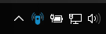
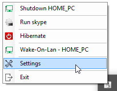
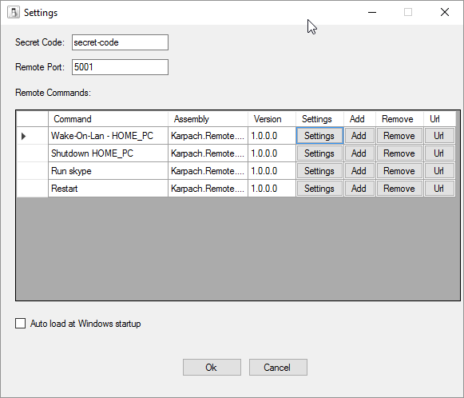
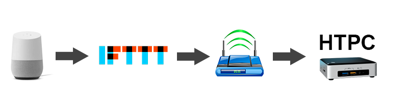

# Remote Controller 
The project is a windows application, which gives an ability to run commands from remote application using http requests (e.g. IFTTT).

The application stays in a system tray area, where you can trigger custom commands as well.

The program has following settings:

1. Load program at Windows startup
2. Specify security code prefix for the url
3. Custom port number for url
4. Supported commands can be dynamically added using command plugins
5. Commands can be used multiple times (e.g. run different windows executables)

Remote controller has following commands already implemented:

1. Wake-on-LAN command
2. Local network HttpRequest command
3. Run Windows executable command
4. Shutdown command

Screenshots:

Example of remote requests:

1. No secret code:

http://remote-host-name:5001/F6BB0695-1FE6-4DCD-AB20-0AEEBAFB6330

2. With secret code:

http://remote-host-name:5001/secret-code/F6BB0695-1FE6-4DCD-AB20-0AEEBAFB6330

You can use Url button in settings to copy command url to clipboard.

Quick start guide:

You can download executable from release section of the project or pull repo and build it yourself in Visual Studio 2017.

Then run executable and you will see a new icon in system tray. Right click on it and select settings.

This will give you the ability to customize remote commands. Open up the desired port on your router and you should be able to run predefined commands from anywhere in the world using your external IP with customized url.

